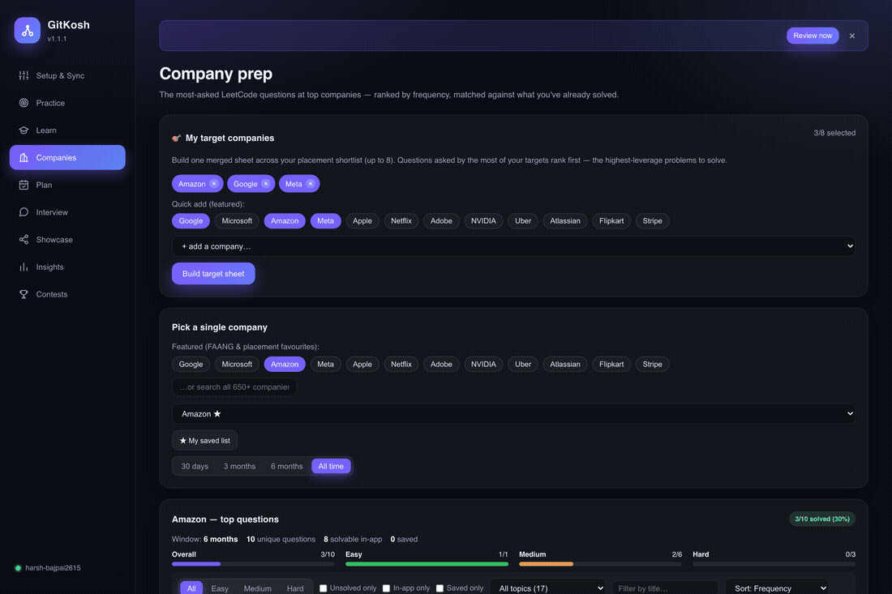
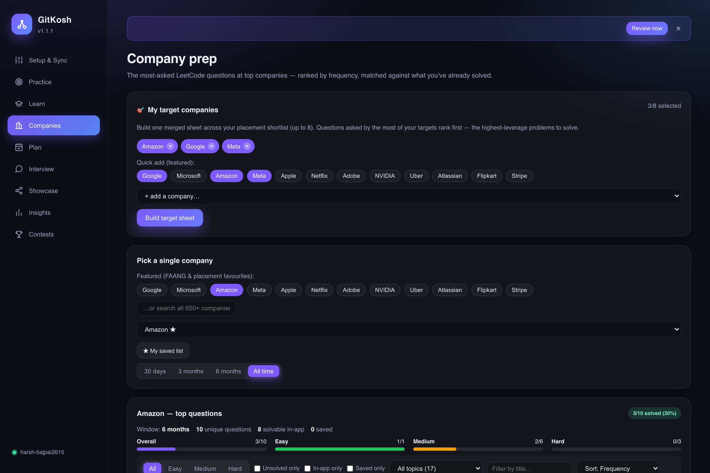
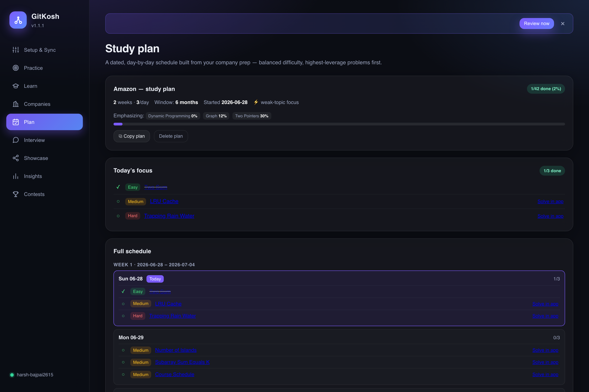
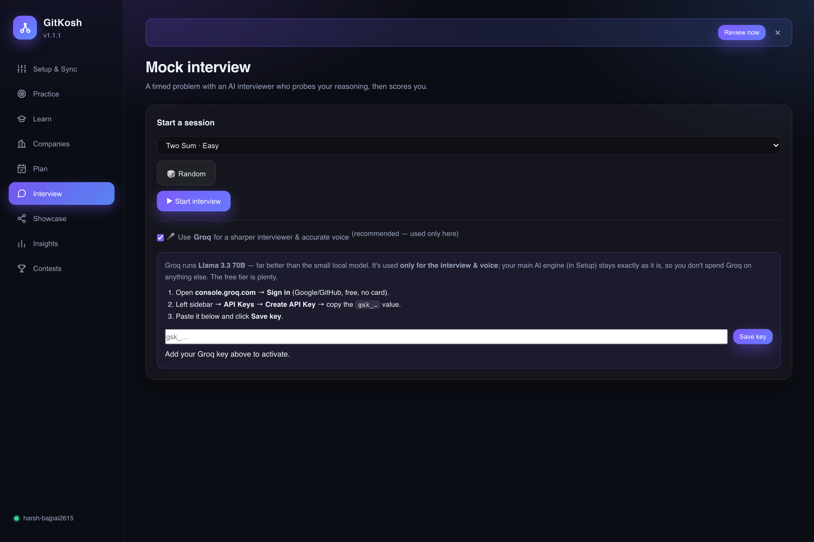
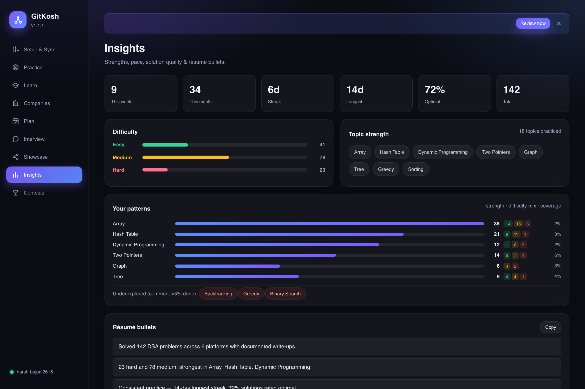

<div align="center">


# GitKosh

**An all-in-one DSA workspace for your Mac.** Practice the full **NeetCode 150 + Blind 75** in a built-in editor with progressive **AI review**, an offline DSA tutor, and spaced-repetition revision — *and* automatically sync your solves from LeetCode, Codeforces, CodeChef, NeetCode, AtCoder & GeeksforGeeks to GitHub, each with an AI-written explanation, on a daily schedule that even keeps your contribution streak alive.


[**⬇ Download for macOS**](https://github.com/harsh-bajpai2615/gitkosh/releases/latest) · [Features](#-features) · [How it works](#%EF%B8%8F-how-it-works) · [Build from source](#%EF%B8%8F-build-from-source)

<br/>



</div>

---

## What is GitKosh?

GitKosh is a macOS app with three halves that feed each other:

1. **Learn & practice** — a built-in code editor for the full **NeetCode 150 + Blind 75** (144 curated problems) with syntax highlighting, one-click **Run / Run tests** in **Python, C++, Java & JavaScript**, and a progressive **AI review** (now **streaming**) that coaches you from a gentle hint to a worked solution. Plus a **mock-interview mode** (timed problem + AI interviewer + scorecard), an offline AI DSA tutor, a pattern library with **practice-this-pattern** drilldowns, an algorithm visualizer, and spaced-repetition **Quiz Me**.
2. **Interview prep by company** — the most-asked LeetCode questions for **657 companies** (FAANG + placement favourites featured), matched against what you've already solved. Filter by difficulty / topic / unsolved, bookmark across companies, build a **multi-company target sheet**, and generate an **auto study plan** — a dated schedule that emphasizes your weak patterns and reminds you daily.
3. **Sync & showcase** — turn your scattered competitive-programming solves into a clean, **documented** GitHub repository, automatically. GitKosh pulls every accepted submission, writes a per-problem README (summary → a numbered algorithm of *your* solution → complexity → key insight), and pushes it on a daily schedule — even keeping your contribution graph green. It can also **import your real past local work** onto the graph with honest dates.

> It's a **mediator**, not an editor. Keep solving on the platforms you love; GitKosh archives and documents the work for you. Your passwords are never stored — it logs in through the system's WebKit cookie store.

## ✨ Features

### 🎯 Company interview prep
- **Most-asked questions for 657 companies.** Pick a company (FAANG + Indian-placement "dream/super-dream" tier featured) and a recency window; see its top LeetCode questions ranked by frequency, each marked ✓ if you've already solved it and *“in-app”* if it's solvable in the built-in editor.
- **Filter, sort & search everything.** Difficulty, **unsolved-only**, in-app-only, saved-only, **topic/pattern**, title search and multiple sorts — with per-difficulty progress bars.
- **Personal saved list & bookmarks** across companies, plus a **Markdown checklist export**.
- **Multi-company target sheet.** Shortlist up to 8 dream companies → one merged, de-duplicated sheet ranked by overlap (*asked at: Amazon, Google, Meta*) — the highest-leverage problems first.
- **Auto study plan.** Turn any company/target view into a dated **N-week schedule** with balanced daily difficulty and an optional **weak-topic emphasis**; a Plan tab tracks progress and a daily reminder nudges you.

### 🎓 Learn & practice
- **Solve in-app in 4 languages — 144 problems.** A built-in editor with **syntax highlighting** for the full **NeetCode 150 + Blind 75**: **Run / Run tests** in **Python, C++, Java or JavaScript** (uses your local toolchains, with a clear install hint if one's missing). Your work is auto-saved per problem.
- **Progressive, streaming AI review.** Stuck? It escalates one step at a time — *small hint → bigger hint → algorithm → pseudocode → worked solution* — **streamed token-by-token**. Got it right? It reviews **complexity, code quality, and optimizations**. (Ollama runs free & offline.)
- **Mock interview mode.** A timed problem with an AI interviewer that probes your reasoning and edge cases, then a structured **scorecard** (overall hire signal, problem-solving, communication, complexity, code quality).
- **AI DSA tutor + pattern library + visualizer.** A streaming chat tutor, a browsable pattern library with **🧩 practice-this-pattern** drilldowns into matching in-app problems, and an animated sorting visualizer.
- **Launch review nudge.** A startup banner when spaced-repetition reviews are due, one click to start them.

### 🔄 Sync, archive & showcase
- **5 logins — that's the whole sync UI.** LeetCode, Codeforces, CodeChef, NeetCode, AtCoder, GeeksforGeeks + GitHub. A guided 3-step flow makes the order obvious.
- **AI write-ups for every problem.** Problem summary → **numbered algorithm of your actual code** → time/space complexity → key insight, in clean Markdown.
- **Import your real past work.** Point GitKosh at a local project folder and it archives it to your repo dated to when you *actually wrote it* — using real git author dates (or file timestamps) — so genuine work you never pushed shows on your contribution graph. Honest backdating, never fabricated.
- **Auto-generated dashboard + polished portfolio site.** Your repo's front page and a one-click **GitHub Pages** site become a living portfolio: totals, streak, difficulty/language/platform/topic breakdowns, and a searchable index of every problem.
- **Real-date commits.** Each solution is committed on the day you *actually solved it*, so your GitHub contribution graph reflects your true history — not one giant dump dated today.
- **Interview-prep exports.** A *Browse by topic* (patterns) view in the dashboard, plus a `study/` folder: **Anki** cards, a **Notion** CSV, and a spaced-repetition **“revise these”** list — auto-generated from your solves.
- **Shareable stats card.** An auto-updating image — solved count, streak, difficulty split, top topics — to embed in your GitHub **profile** README (one-click *Copy embed code*).
- **One-click portfolio site.** Publish a searchable, themed **GitHub Pages** site of your solves straight from the app.
- **Progress posts.** Generate dev.to / LinkedIn / X drafts from your recent solves — a built-in personal-brand engine.
- **AI solution coach.** Every write-up honestly assesses whether *your* solution is optimal — and suggests a better approach (with complexity) when it isn't.
- **Insights dashboard.** In-app analytics: a **per-topic strength** breakdown (difficulty-weighted, with coverage and an *underexplored patterns* callout), difficulty mastery, pace & streak, “% optimal”, a *revisit* list, and copy-able **résumé bullets** (also saved as `insights.md`).
- **Quiz me.** Spaced-repetition recall — GitKosh shows a past problem and you recall the approach before revealing it.
- **Contest tracker.** Upcoming rounds across Codeforces & LeetCode, plus your Codeforces rating curve — right in the app.
- **Browser extension (beta).** A companion that captures accepted LeetCode submissions **in real time** and pushes to GitHub — so it works on **Windows & Linux** too.
- **Reset & re-backfill.** One click rebuilds the whole repo as a clean, backdated history that mirrors your real solving timeline.
- **Bring-your-own AI — including free & local.** Google Gemini, Groq, or **one-click local Ollama** (no key, no limits, fully private).
- **Daily auto-sync.** A background scheduler runs even when the app is closed — no reminders, no clicking.
- **Streak keeper.** On days with no new solves, it makes a small dated commit so your GitHub streak stays alive.
- **In-app auto-update.** New versions install themselves with one click.
- **Nothing to install on your Mac.** No `git`, no terminal, no Python — it talks to GitHub over the API and ships its own runtime.
- **Live progress.** A real progress bar: *Fetching → Writing READMEs i/N → Pushing → Done.*

## 🎯 Company prep tab

<div align="center"></div>

The most-asked LeetCode questions for **657 companies** (FAANG + Indian-placement favourites featured), ranked by frequency and matched against what you've already solved. Filter by **difficulty / topic / unsolved / in-app**, bookmark across companies, and build a **multi-company target sheet** that merges your shortlist and ranks the highest-overlap problems first.

## 📅 Study plan tab

<div align="center"></div>

Turn any company (or your target sheet) into a **dated, day-by-day schedule** with balanced daily difficulty and an optional **weak-topic emphasis**. A "Today's focus" card tells you exactly what to solve, progress tracks against your real solves, and a daily reminder keeps you on pace.

## 🎤 Mock interview tab (voice)

<div align="center"></div>

A timed problem with an AI interviewer that **speaks its questions aloud** and lets you **answer by voice** (auto-listen between turns), then grades you with a structured scorecard. Optionally flip on **Groq just for the interview & voice** — a far sharper interviewer (Llama 3.3 70B) without changing your main, free/local AI engine.

## 🎓 Learn & Solve tab

<div align="center"></div>

Practice the full **NeetCode 150 + Blind 75** without leaving the app: a syntax-highlighted editor that **runs Python, C++, Java & JavaScript**, **Run / Run tests**, a streaming AI tutor, a pattern library with practice drilldowns, and an algorithm visualizer — all on one page.

<div align="center"></div>

Tap **✨ AI Review** and GitKosh coaches you *progressively* — a small hint first, then a bigger one, then the algorithm, then pseudocode, and only the full worked solution if you still need it. Solve it correctly and it switches to reviewing your complexity, code quality, and how to optimize further.

## ✨ Showcase tab

<div align="center"></div>

A live stats card, a one-click portfolio website, and shareable progress posts — all generated from your own solves, right inside the app.

## 📊 Insights tab

<div align="center"></div>

Topic strengths, difficulty mastery, solving pace, AI solution-quality coaching, résumé bullets, and a built-in spaced-repetition quiz.

## 🏆 Contests tab

<div align="center"></div>

Upcoming Codeforces & LeetCode rounds with one-click open, plus your Codeforces rating curve.

## 🌐 Browser extension (beta) — real-time + cross-platform

The macOS app is the full experience; the [`extension/`](extension) folder is a lightweight
**Chrome/Edge/Brave** companion that pushes your **accepted LeetCode submissions to GitHub the
instant they pass** — so it also runs on **Windows & Linux**. Load it unpacked, paste a GitHub
token + repo, and solve. See [`extension/README.md`](extension/README.md).

## 📥 Install

1. Download the latest **`gitkosh.dmg`** from [**Releases**](https://github.com/harsh-bajpai2615/gitkosh/releases/latest).
2. Open it and drag **GitKosh** into **Applications**.
3. **First launch.** GitKosh is free and open-source but not Apple-notarized (that needs a paid Apple Developer account), so macOS shows *"Apple could not verify GitKosh is free of malware."* This is expected for any indie app — pick whichever unlock works for your macOS:

   **macOS 15 Sequoia & newer** (the dialog only offers *Done* / *Move to Bin*):
   - Click **Done**, then open **System Settings → Privacy & Security**, scroll down to *"GitKosh was blocked…"* and click **Open Anyway** → confirm with Touch ID / password. It opens normally forever after.

   **macOS 14 & earlier:** **right-click the app → Open → Open** — once.

   **One-line alternative (any version)** — clears the download quarantine flag, then it just opens:
   ```bash
   xattr -dr com.apple.quarantine /Applications/GitKosh.app
   ```

   After the first unlock, GitKosh opens with a double-click and updates itself in place.

## 🚀 Usage

1. **Connect GitHub** — one-tap "Login with GitHub" (OAuth device flow).
2. **Connect your coding sites** — log in; handles are detected automatically.
3. **Choose write-ups** — paste a free Gemini/Groq key, or set up **Ollama** in one click (free, local).
4. **Sync** — or flip on **daily auto-sync** and forget about it.

Your solutions land in your repo like this:

```
leetcode/0001-two-sum/
├── solution.py
└── README.md      # problem · algorithm · complexity · key insight
```

## 🤖 Write-up providers

| Provider | Cost | Setup | Daily limit |
|---|---|---|---|
| **Ollama** (local) | Free | One-click install, in-app | None |
| **Groq** | Free tier | Paste an API key | High |
| **Gemini** | Free tier | Paste an API key | Low |
| **None** | Free | Nothing | No AI — statement + code only |

## ⏰ Automation & streak keeping

Turn on **“Sync automatically every day”** and GitKosh installs a macOS LaunchAgent that runs a sync daily — even with the app closed. With **“Keep my GitHub streak alive”** on, days with no new solves still get a small dated commit to `activity/streak.md`, so your contribution graph stays green.

## 🏗️ How it works

- **Login** — a native WebKit window captures your session cookie (no passwords stored); GitHub uses OAuth **Device Flow** (no client secret shipped).
- **Fetch** — one extractor per platform (LeetCode GraphQL, Codeforces API + page scrape, CodeChef scrape, NeetCode via LeetCode).
- **Document** — a pluggable LLM layer writes each README from your code + the official statement.
- **Push** — the GitHub **REST API** (Git Data API) commits everything; no `git`/`gh` needed on your machine.
- **Schedule** — a LaunchAgent runs the same headless sync on a daily cron.
- **Update** — the app checks GitHub Releases on launch and self-replaces.

```
LeetCode ─┐
Codeforces┤   WebKit login (cookies)         Gemini / Groq / Ollama (write-ups)
CodeChef ─┼─▶ extractors ─▶ submissions ─▶  README generator ─▶ GitHub API ─▶ your repo
NeetCode ─┘   GitHub Device Flow (token)     scheduler (daily) + streak keeper
```

## 🖥️ The app

GitKosh ships as a modern, animated desktop app built on **pywebview** (a native WebKit window),
in `webui/` + `app/webmain.py`. A glassmorphism sidebar, gradient buttons, animated stat tiles,
difficulty bars, and a live rating chart — all driven by the **same Python backend** over a
JS↔Python bridge, with no logic duplicated.

<div align="center"></div>

Run it from source:

```bash
.venv-app/bin/python -m pip install pywebview
.venv-app/bin/python -m app.webmain
```

The **Practice** tab is a daily-use study system:

- **Spaced-repetition Quiz Me** (SM-2): rate *Again / Hard / Good / Easy*; only due cards resurface; review-streak tracking.
- **Three quiz modes:** Recall, **Type → AI-graded** recall, and **Pattern** (multiple-choice topic guess).
- **Problem of the Day** — what to review or solve next, plus your weakest topics.
- **Roadmaps** — live **Blind 75** & **NeetCode 150** progress from your solves.
- The scheduled daily run also sends a **macOS reminder** when reviews are due.

The **Learn** tab is *learn + solve in one place* — see [Learn & Solve](#-learn--solve-tab) above:
the in-app editor for all 144 problems, progressive AI review, the DSA tutor, the pattern library,
and the algorithm visualizer.

> `webui/index.html` also opens directly in a browser with sample data.

## 🛠️ Build from source

Requires macOS and a [python.org](https://www.python.org/downloads/macos/) framework Python (3.13 recommended).

```bash
git clone https://github.com/harsh-bajpai2615/gitkosh
cd gitkosh
./build_app.sh          # → dist/gitkosh.app + dist/gitkosh.dmg
```

Cut a release that installed copies will auto-update to:

```bash
# 1) bump VERSION (semver) in app/constants.py
# 2) add a section for it to CHANGELOG.md  (release.sh pulls it into the notes)
# 3) publish:
./release.sh
```

`release.sh` enforces the bump — it validates semver and **refuses to re-ship an
already-published version** (so installed copies always see a strictly higher
version), warns on an uncommitted tree, and uses your CHANGELOG entry as the
release notes. (Set `RELEASE_FORCE=1` only to re-upload assets for the same tag.)

## 📂 Project structure

```
app/            macOS app — UI bridge, WebKit login, sync core, scheduler, updater,
                runner (multi-language), companies/studyplan/backfill, insights, site
app/data/       bundled company catalog (companies.json) + LeetCode topic map
gitkosh/        platform extractors, README generator (+ streaming), GitHub helpers
extension/      cross-platform browser extension (real-time LeetCode → GitHub)
webui/          pywebview front-end (index.html / app.js / style.css)
setup.py        py2app bundle config           build_app.sh   build .app + .dmg
release.sh      build + publish a release       CHANGELOG.md   release notes source
```

## ⚠️ Notes & limitations

- **macOS only** (uses native WebKit + LaunchAgents).
- **Not notarized yet** — first launch needs right-click→Open; updates after that are seamless.
- **CodeChef** is best-effort (Cloudflare, no public API).
- **AtCoder** pulls AC submissions via the kenkoooo API + scrapes each submission's source.
- **GeeksforGeeks** is **index-only** (titles + links + difficulty) — GFG exposes no submitted source code, so there are no `solution.*` files for it.
- Free **Gemini** has a low daily cap — use **Ollama** (local) or **Groq** for large backfills.
- Your data (logins, settings, history) lives in `~/Library/Application Support/GitKosh/` and survives updates.

## License

[MIT](LICENSE) © Harsh Bajpai

<div align="center"><sub>Made for people who solve a lot and document too little.</sub></div>
