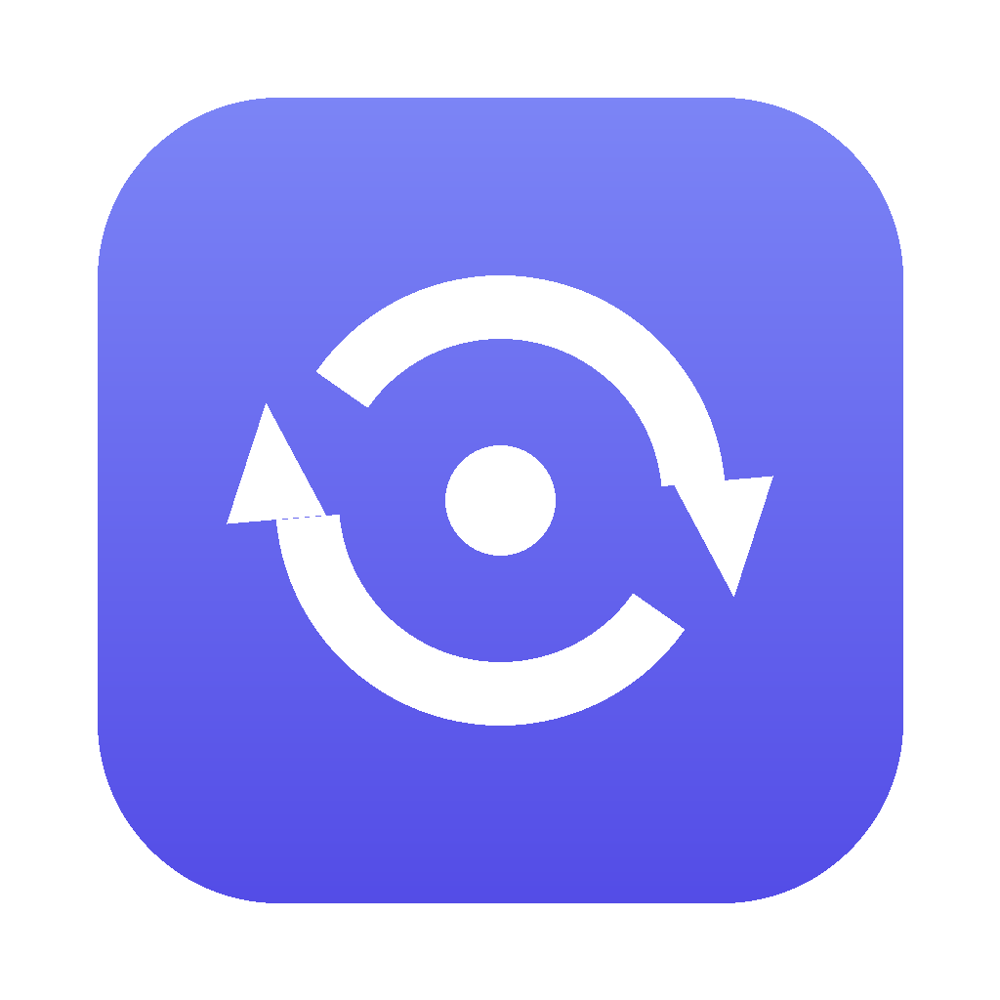
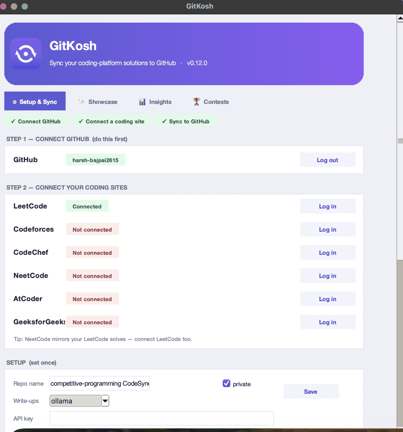
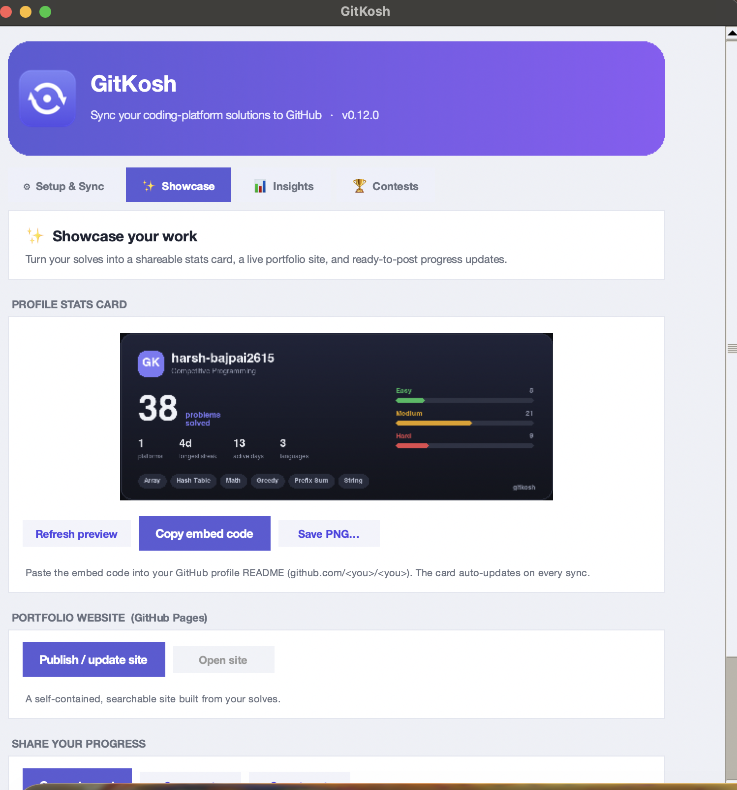
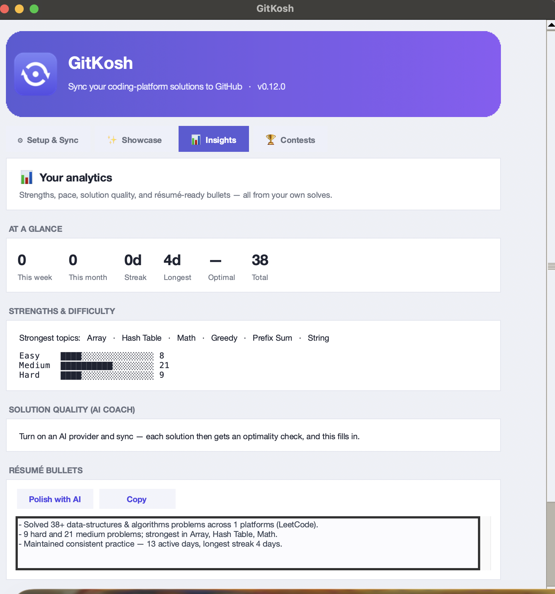
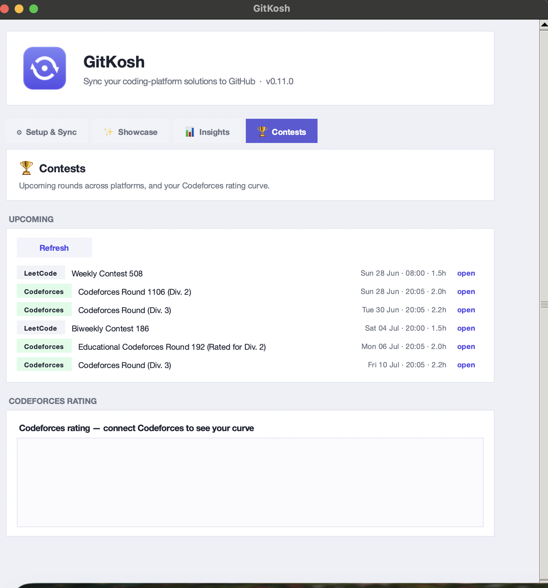

<div align="center">



# GitKosh

**Automatically sync your competitive-programming solutions from LeetCode, Codeforces, CodeChef, NeetCode, AtCoder & GeeksforGeeks to GitHub — each with an AI-written explanation, on a daily schedule that even keeps your contribution streak alive.**


[**⬇ Download for macOS**](https://github.com/harsh-bajpai2615/gitkosh/releases/latest) · [Features](#-features) · [How it works](#%EF%B8%8F-how-it-works) · [Build from source](#%EF%B8%8F-build-from-source)

<br/>



</div>

---

## What is GitKosh?

GitKosh is a tiny macOS app that turns your scattered competitive-programming solves into a clean, organized, **documented** GitHub repository — automatically. Log into your accounts once; GitKosh pulls every accepted submission, writes a per-problem README (problem summary → a numbered algorithm of *your* solution → complexity → key insight), and pushes it all to GitHub. Put it on a daily schedule and it keeps running — even keeping your contribution graph green.

> It's a **mediator**, not an editor. Keep solving on the platforms you love; GitKosh archives and documents the work for you. Your passwords are never stored — it logs in through the system's WebKit cookie store.

## ✨ Features

- **5 logins — that's the whole UI.** LeetCode, Codeforces, CodeChef, NeetCode, AtCoder, GeeksforGeeks + GitHub. A guided 3-step flow makes the order obvious.
- **AI write-ups for every problem.** Problem summary → **numbered algorithm of your actual code** → time/space complexity → key insight, in clean Markdown.
- **Auto-generated dashboard.** Your repo's front page becomes a living portfolio: totals, solving streak, difficulty/language/topic breakdowns, and an index of every problem.
- **Real-date commits.** Each solution is committed on the day you *actually solved it*, so your GitHub contribution graph reflects your true history — not one giant dump dated today.
- **Interview-prep exports.** A *Browse by topic* (patterns) view in the dashboard, plus a `study/` folder: **Anki** cards, a **Notion** CSV, and a spaced-repetition **“revise these”** list — auto-generated from your solves.
- **Shareable stats card.** An auto-updating image — solved count, streak, difficulty split, top topics — to embed in your GitHub **profile** README (one-click *Copy embed code*).
- **One-click portfolio site.** Publish a searchable, themed **GitHub Pages** site of your solves straight from the app.
- **Progress posts.** Generate dev.to / LinkedIn / X drafts from your recent solves — a built-in personal-brand engine.
- **AI solution coach.** Every write-up honestly assesses whether *your* solution is optimal — and suggests a better approach (with complexity) when it isn't.
- **Insights dashboard.** In-app analytics: topic strengths, difficulty mastery, pace & streak, “% optimal”, a *revisit* list, and copy-able **résumé bullets** (also saved as `insights.md`).
- **Quiz me.** Spaced-repetition recall — GitKosh shows a past problem and you recall the approach before revealing it.
- **Contest tracker.** Upcoming rounds across Codeforces & LeetCode, plus your Codeforces rating curve — right in the app.
- **Browser extension (beta).** A companion that captures accepted LeetCode submissions **in real time** and pushes to GitHub — so it works on **Windows & Linux** too.
- **Reset & re-backfill.** One click rebuilds the whole repo as a clean, backdated history that mirrors your real solving timeline.
- **Bring-your-own AI — including free & local.** Google Gemini, Groq, or **one-click local Ollama** (no key, no limits, fully private).
- **Daily auto-sync.** A background scheduler runs even when the app is closed — no reminders, no clicking.
- **Streak keeper.** On days with no new solves, it makes a small dated commit so your GitHub streak stays alive.
- **In-app auto-update.** New versions install themselves with one click.
- **Nothing to install on your Mac.** No `git`, no terminal, no Python — it talks to GitHub over the API and ships its own runtime.
- **Live progress.** A real progress bar: *Fetching → Writing READMEs i/N → Pushing → Done.*

## ✨ Showcase tab

<div align="center"></div>

A live stats card, a one-click portfolio website, and shareable progress posts — all generated from your own solves, right inside the app.

## 📊 Insights tab

<div align="center"></div>

Topic strengths, difficulty mastery, solving pace, AI solution-quality coaching, résumé bullets, and a built-in spaced-repetition quiz.

## 🏆 Contests tab

<div align="center"></div>

Upcoming Codeforces & LeetCode rounds with one-click open, plus your Codeforces rating curve.

## 🌐 Browser extension (beta) — real-time + cross-platform

The macOS app is the full experience; the [`extension/`](extension) folder is a lightweight
**Chrome/Edge/Brave** companion that pushes your **accepted LeetCode submissions to GitHub the
instant they pass** — so it also runs on **Windows & Linux**. Load it unpacked, paste a GitHub
token + repo, and solve. See [`extension/README.md`](extension/README.md).

## 📥 Install

1. Download the latest **`gitkosh.dmg`** from [**Releases**](https://github.com/harsh-bajpai2615/gitkosh/releases/latest).
2. Open it and drag **GitKosh** into **Applications**.
3. First launch (the app isn't notarized yet): **right-click → Open → Open** — once. After that it opens normally and updates itself.

## 🚀 Usage

1. **Connect GitHub** — one-tap "Login with GitHub" (OAuth device flow).
2. **Connect your coding sites** — log in; handles are detected automatically.
3. **Choose write-ups** — paste a free Gemini/Groq key, or set up **Ollama** in one click (free, local).
4. **Sync** — or flip on **daily auto-sync** and forget about it.

Your solutions land in your repo like this:

```
leetcode/0001-two-sum/
├── solution.py
└── README.md      # problem · algorithm · complexity · key insight
```

## 🤖 Write-up providers

| Provider | Cost | Setup | Daily limit |
|---|---|---|---|
| **Ollama** (local) | Free | One-click install, in-app | None |
| **Groq** | Free tier | Paste an API key | High |
| **Gemini** | Free tier | Paste an API key | Low |
| **None** | Free | Nothing | No AI — statement + code only |

## ⏰ Automation & streak keeping

Turn on **“Sync automatically every day”** and GitKosh installs a macOS LaunchAgent that runs a sync daily — even with the app closed. With **“Keep my GitHub streak alive”** on, days with no new solves still get a small dated commit to `activity/streak.md`, so your contribution graph stays green.

## 🏗️ How it works

- **Login** — a native WebKit window captures your session cookie (no passwords stored); GitHub uses OAuth **Device Flow** (no client secret shipped).
- **Fetch** — one extractor per platform (LeetCode GraphQL, Codeforces API + page scrape, CodeChef scrape, NeetCode via LeetCode).
- **Document** — a pluggable LLM layer writes each README from your code + the official statement.
- **Push** — the GitHub **REST API** (Git Data API) commits everything; no `git`/`gh` needed on your machine.
- **Schedule** — a LaunchAgent runs the same headless sync on a daily cron.
- **Update** — the app checks GitHub Releases on launch and self-replaces.

```
LeetCode ─┐
Codeforces┤   WebKit login (cookies)         Gemini / Groq / Ollama (write-ups)
CodeChef ─┼─▶ extractors ─▶ submissions ─▶  README generator ─▶ GitHub API ─▶ your repo
NeetCode ─┘   GitHub Device Flow (token)     scheduler (daily) + streak keeper
```

## 🧪 Next-gen web UI (preview)

A modern, animated UI built on **pywebview** (a native WebKit window) is in `webui/` +
`app/webmain.py`. It reuses the **same Python backend** — no logic duplicated — and adds a
glassmorphism sidebar, gradient buttons, animated stat tiles, difficulty bars, and a live rating
chart.

<div align="center"></div>

Run the preview:

```bash
.venv-app/bin/python -m pip install pywebview
.venv-app/bin/python -m app.webmain
```

It also adds a **Practice** tab — a daily-use study system:

- **Spaced-repetition Quiz Me** (SM-2): rate *Again / Hard / Good / Easy*; only due cards resurface; review-streak tracking.
- **Three quiz modes:** Recall, **Type → AI-graded** recall, and **Pattern** (multiple-choice topic guess).
- **Problem of the Day** — what to review or solve next, plus your weakest topics.
- **Roadmaps** — live **Blind 75** & **NeetCode 150** progress from your solves.
- The scheduled daily run also sends a **macOS reminder** when reviews are due.

It's a working prototype (real data via a JS↔Python bridge); bundling it as the default app is the
next step. `webui/index.html` also opens directly in a browser with sample data.

## 🛠️ Build from source

Requires macOS and a [python.org](https://www.python.org/downloads/macos/) framework Python (3.13 recommended).

```bash
git clone https://github.com/harsh-bajpai2615/gitkosh
cd gitkosh
./build_app.sh          # → dist/gitkosh.app + dist/gitkosh.dmg
```

Cut a release that installed copies will auto-update to:

```bash
# bump VERSION in app/constants.py, then:
./release.sh
```

## 📂 Project structure

```
app/            macOS app — GUI, WebKit login, sync core, scheduler, updater, Ollama setup
gitkosh/        platform extractors, README generator, GitHub helpers
extension/      cross-platform browser extension (real-time LeetCode → GitHub)
setup.py        py2app bundle config           build_app.sh   build .app + .dmg
release.sh      build + publish a release       tools/         app-icon generator
```

## ⚠️ Notes & limitations

- **macOS only** (uses native WebKit + LaunchAgents).
- **Not notarized yet** — first launch needs right-click→Open; updates after that are seamless.
- **CodeChef** is best-effort (Cloudflare, no public API).
- **AtCoder** pulls AC submissions via the kenkoooo API + scrapes each submission's source.
- **GeeksforGeeks** is **index-only** (titles + links + difficulty) — GFG exposes no submitted source code, so there are no `solution.*` files for it.
- Free **Gemini** has a low daily cap — use **Ollama** (local) or **Groq** for large backfills.
- Your data (logins, settings, history) lives in `~/Library/Application Support/GitKosh/` and survives updates.

## License

[MIT](LICENSE) © Harsh Bajpai

<div align="center"><sub>Made for people who solve a lot and document too little.</sub></div>
